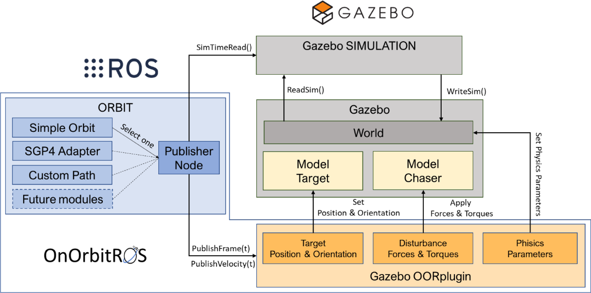
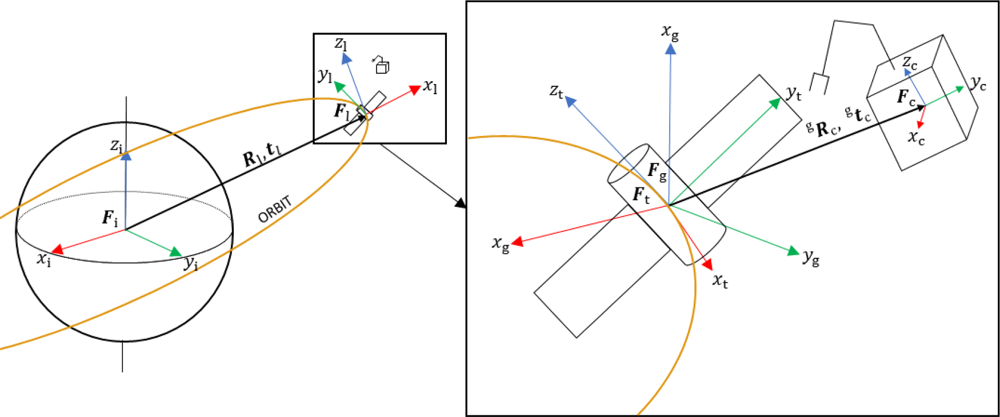
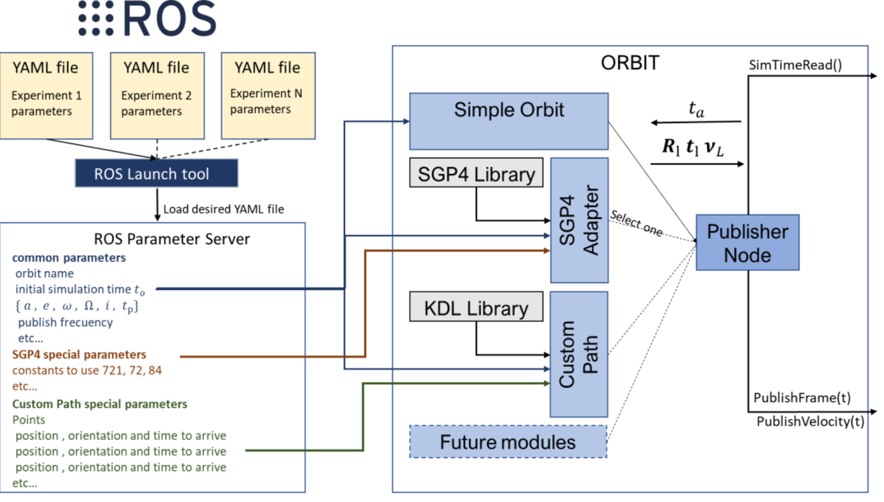
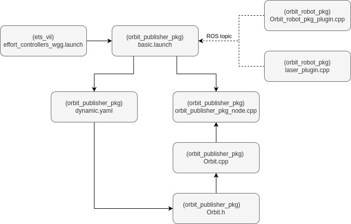
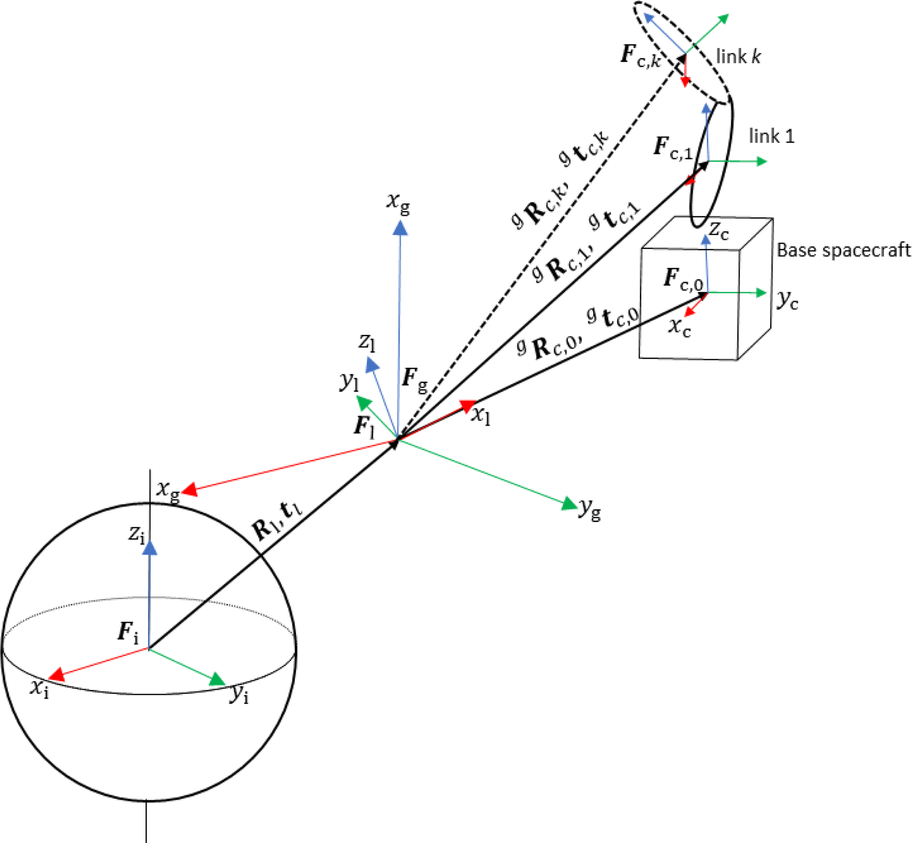
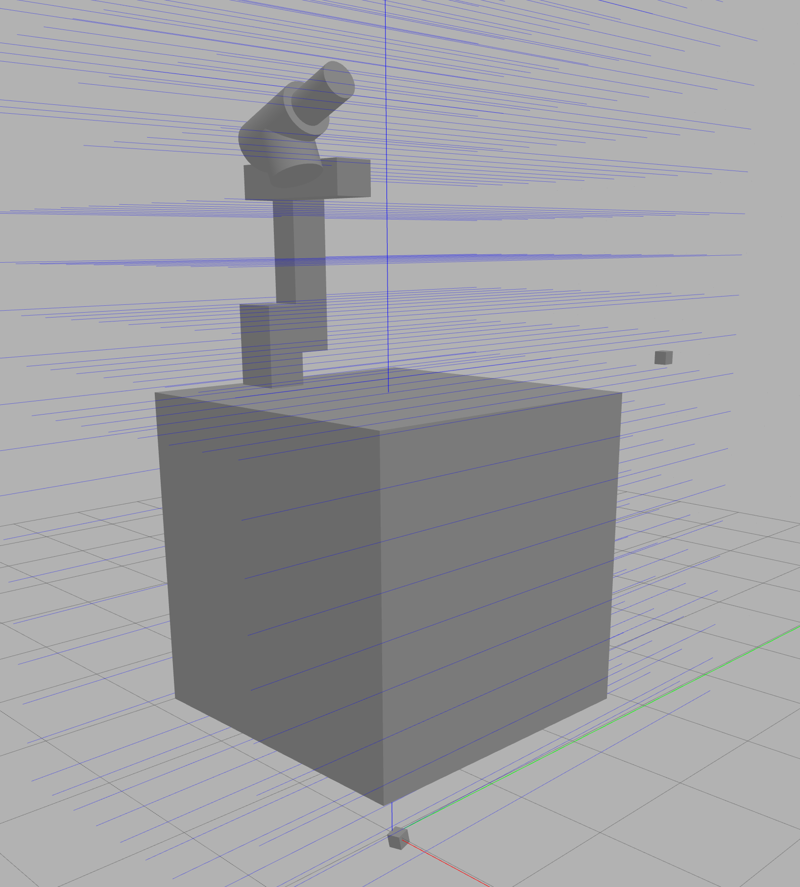

# Architecture of OnOrbitROS

OnOrbitROS serves as a foundational platform for the study and development of on-orbit applications, leveraging the powerful
combination of ROS and Gazebo for hyper-realistic simulations.

Here you can find the architecture of the framework. In the OnOrbitROS workspace installed (see [Installation Guide](/Install) for more info on how to install it) you will find many pacakges, and the main structure is shown in the follwowing image. 

!!! note
    For extended information about this framework, its architecture, packages and controllers, and some applications go to [doi](https://doi.org/10.1016/j.simpat.2023.102790).
    
    > <span style="color:gray">
        Ramón, J. L., Pomares, J., & Felicetti, L. (2023). <br>
        Task space control for on-orbit space robotics using a new ROS-based framework. <br>
        Simulation Modelling Practice and Theory, 127(102790), 102790. <br>
        [https://doi.org/10.1016/j.simpat.2023.102790](https://doi.org/10.1016/j.simpat.2023.102790)
    </span>

There are two main packages: 

1. <span style="color:blue">ORBIT</span>: generates spacecraft trajectories.
2. <span style="color:darkorange">Gazebo OORplugin</span>: extends and modifies the physics engine to align with the conditions of an On Orbit Servicing (OOS) application.

This image also shows the two main elements of an OOS application: the target spacecraft (**target**) and the servicing spacecraft (**chaser**), which hosts the robot or serves as the robot itself. All models are defined using Simulation Description Format (SDF) definitions. From this structure, complex OOS systems can be simulated with elements such as force sensors, cameras, laser sensors, etc, as well as complex robots as humanoids. 



---

## Reference Frames

The following image represent the different elements found in OOS and their reference frames: 

- **F<sub>t</sub>**: Located at the center of mass of the target spacecraft. 
- **F<sub>c</sub>**: Located at the center of mass of the chaser.
- **F<sub>i</sub>**: Earth-Centered Inertial frame (ECI), located at the center of Earth with its <em>x</em> axis going from the center of Earth passing along the vernal equinox, the <em>z</em> axis coincident with the axis of rotation of the Earth and pointing to the north pole, and the <em>y</em> axis completing the orthogonal triad. 
- **F<sub>l</sub>**: Local Vertical Local Horizontal (LVLH) to define the position of any object with respect to a specific orbital position with the <em>x</em> axis coincident with the direction of the radial vector that goes from the center of Earth to the spacecraft, the <em>y</em> axis that with the x axis form the orbital plane and describes the direction of the spacecraft's movement, and the <em>z</em> axis completing the triad being normal to the orbital plane.
- **R<sub>l</sub>** and **t<sub>l</sub>**: represent the rotation and translation of the LVLH frame with respect to the ECI. 
- **F<sub>g</sub>**: the Gazebo own reference frame, assumed to have the same orientation as F<sub>i</sub> (ECI) but centered as F<sub>l</sub> (LVLH). That way we can simulate the proximity dynamics of the chaser around the target, assuming that the latter is moving along its orbit and the relative orientation between F<sub>l</sub> and F<sub>g</sub> is given by R<sub>l</sub> , calculated by the Orbit module. 
- **<sup>g</sup>R<sub>c</sub>** and **<sup>g</sup>t<sub>c</sub>**: represent the rotation and translation matrices to describe the relative attitude and position of the chaser frame with respect to the Gazebo frame.



---

## ORBIT

The main function of this module, implemented as a ROS publisher node, is to generate the orbital trajectories of the bodies that compose the simulation. It has this submodules: 

1. **Simple Orbit**: This module can be used for the generation of trajectories that describe Keplerian orbits. This module is described in greater detail in Appendix A of the above mentioned paper in the <span style="color:blue">Note</span>. It is the default option for OnOrbitROS and it does not require any external library.
2. **Custom Path**: This module can be used to model user-defined trajectories that do not fall in the previous case. It uses the external library Kinematics and Dynamics Library (KDL) to generate trajectories based on a series of points by interpolating them by splines. In this case, a series of points are introduced by the user in the ROS parameter server (a data structure composed of a set of positions, velocities and accelerations, and the time instant in seconds to achieve each pose), and the Custom Path module generates the interpolated trajectory.

The user defines the orbit or trajectory that best fits the trajectory to be modelled in the launch file, and the Publisher Node in­stantiates the corresponding object. The Publisher Node provides the timing to the corresponding object, and the object generates the values R<sub>l</sub> , t<sub>l</sub> and ν<sub>l</sub> of the generated orbit or trajectory. Different parameters are required depending on the orbit or trajectory to be generated. For example, for the Simple Orbit module, parameters such as the semi-major axis, <em>a</em>, eccentricity, <em>e</em>, argument of periapsis, <em>w</em>, right ascension of ascending node, <em>Ω</em>, inclination, <em>i</em>, and instant of time of perigee passage, <em>tp</em> should be defined. Finally, for defining a custom trajectory, initial, final, and intermediate positions, velocities, accelerations and times should be provided. This information is indicated by the user in the YAML configuration file and stored in the ROS Parameter Server. The ROS Parameter server is common to all nodes and allows sharing of parameters between different nodes.



> ### Define an Orbit

The orbit is **declared** in a .yaml file located in `orbit_ws > orbit_publisher_pkg > config` (by default the file is `dynamic_orbit.yaml`). Then that file has to be loaded in the project's **launch**, which by default is `basic.launch` or `fix_basic.launch` for fixed orbits, and located under `orbit_ws > orbit_publisher_pkg > launch`. That launch is then called from the project's main package, for example for the ETS VII application is `orbit_ws > ets_vii > launch > effort_controllers_wgg.launch`. The information defines the LVLH in reference to the ECI.

The information from the orbit .yaml file is **read by** `orbit_ws > orbit_publisher_pkg > src > Orbit.cpp` (that uses `Orbit.h` header that has all the variables and methods **defined**). The relevant orbit information is then **published** in their corresponding topics from the file `orbit_ws > orbit_publisher_pkg > src > orbit_publisher_pkg_node.cpp` (for fixed orbits the information is published from `fix_orbit_publisher_pkg_node.cpp`). In case more orbital information wants to be shared with the plugin it will be published from this script. 

>> #### Default Orbit Information
Orbit information declared in the `.yaml` file in the <em>Simple Orbit</em> default module:

```yaml
            publish rate
            eccentricity
            semi major axis
            inclination
            rate of right ascension
            initial right ascension
            rate of argument of perigee
            initial argument of perigee
            initial mean anomaly
            time pass perigee
            time start
            angular velocity
            atmosphere angular velocity
            atmosphere air density
            drag coefficient
```

>> #### Published Orbit Information
Information being published in the following topics: 

```yaml
            /OrbitPosition
            /OrbitVelocity
            /AtmosphereAngularVelocity
            /OrbitAirDensity
            /OrbitDragCoeffient
```

>> #### Add more Orbit Information
In case more orbital information is needed, it can be **declared** in the `.yaml` file, **defined** in `Orbit.h`, **read** by `Orbit.cpp`and (if needed), **published** from `orbit_publisher_pkg_node.cpp`.


>> #### Hierarchy
Hierarchy of the files involved in the declaration and use of the orbit for the ETS VII example:



---

## Gazebo OORplugin

This module in OnOrbitROS is responsible for modifying the parameters of the physics engines used by Gazebo to create a realistic simulation environment for OOS applications. It eliminates effects like gravity, wind, and magnetism, typically applied in simulations assuming they occur on the Earth’s surface. Instead, this module applies the relevant torques and forces specific to OOS scenarios.

A plugin has been developed to consider the following perturbations that are present in orbital applications: 

* Gravity gradient.
* Forces generated by the relative motion to an elliptical orbital.
* Atmospheric drag.

> ### Applied perturbations

As the orbit is defined in the package `orbit_robot_publisher`, the OORplugin is mainly found under `orbit_robot_pkg`. 

>> #### Load and use the plugin

The defined spacecraft, located under the project's package urdf folder, must include the following plugins, one for the control and the other lo load the Gazebo OORplugin. The page [Add a spacecraft](/application/#add-a-spacecraft) of this documentation has a guide on how to define this URDF. 

    <gazebo>
        <plugin name="gazebo_ros_control" filename="libgazebo_ros_control.so">
            <robotNamespace>/</robotNamespace>
        </plugin>
        
       <plugin name="Orbit_robot_pkg_plugin" filename="libOrbit_robot_pkg_plugin.so"/> 
    </gazebo>

That plugin is defined under `> orbit_ws > src > orbit_robot_pkg > src > Orbit_robot_pkg_plugin.cpp`, and uses the header `OrbitLink.h` from `OrbitLink.cpp`. These two latter files are used to define the properties of each link of the spacecraft, both cinematically and dynamically (such as positions, torques, velocities, etc), and to apply the gravity gradient and forces generated by the relative motion to an elliptical . Then, those methods are used by the principal file, `Orbit_robot_pkg_plugin.cpp`, that manages the subscription to the orbital topics explained above and manages the application of those perturbations and the atmospheric drag. The script includes comments that can be checked to better understand the implementation.

> ### Perturbation from Gravity Gradient

Calculates the main perturbing torques caused by the gravity gradient and simulates them with OnOrbitROS. These torques vary in the different parts of each rigid body that form the chaser spacecraft (each link of the model), and once they are calculated, they are applied in each iteration of the simulation by this module. 

In the next image you can see the main transformations to compute the perturbing torques for the ETS VII example, and more information about the equations behind the calculus can be found in the paper on the <span style="color:blue">Note</span>.



> ### Relative motion with respect to an elliptical orbit

Computes the apparent forces due to the relative motion with respect to the reference frame describing the orbit. These forces are of great importance in operations where a chaser satellite flies in proximity of a target. Such forces are calculated and applied to each body of the OOS scenario, alongside the gravity gradient forces, by the module Gazebo OORplugin at each iteration of the simulation.

> ### Atmospheric drag

In relation to the atmospheric drag, it affects the surfaces going in the opposite direction of motion (the relative velocity vector) and, in those points, the corresponding force is applied. This perturbation is greater when closer to the Earth surface, as the atmosphere gains in density and importance. 

$$ \mathbf{D} = - D\mathbf{v_{rel}} $$

$$ D = \frac{1}{4} \rho v_{\text{rel}}^2 C_D A $$

>> Where \( \rho \) is the air density, \( v_{\text{rel}} \) the relative velocity of the spacecraft in relation to the atmosphere, \( C_D \) the drag coefficient, and \( A \) the area of impact.

The area of impact of the air with the surface has been simulated using a matrix of single rays, as it is shown in the next image, so the drag is calculated and applied in the area corresponding to each ray. That matrix has to be modified on each application so it covers all the models, and that can be done from the world's file. For example, in the default case of the ETS VII project changing the call to the laser scaner xacro from `> orbit_ws > src > ets_vii > worlds > no_gravity.world.xacro`: 

    <xacro:include filename="$(find ets_vii)/urdf/laser_scan.xacro"/>   <!-- Xacro for the laser sensor -->
    
    <!--- Load Sensors -->    
      <!-- 
        Pose offset in relation to "laser_link"; 
        Configuration of the ray: lenght, number of rays, angles of the cone; 
        Configuration of the matrix of rays: x and z number and separation; 
        Topic to publish the data (coincident with the name of the URDF spacecraft model);
      -->   
    <xacro:multi_laser_scan     
              x="-1.1"          
              y="3" 
              z="0.8"
              roll="0"
              pitch="0"
              yaw="-1.5708"
              visualize="true"
              samples="1"
              min_angle="-0.0"
              max_angle="0.0"
              length_ray="5"
              num_lasers_x="10"
              num_lasers_z="20"
              offset_x="0.25" 
              offset_z="0.25" 
              topic="robot"
              reference_link="etsVii_laser_link"/>




